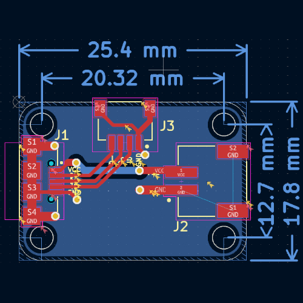

# MicroUSB2JST

## Overview
**MicroUSB2JST** is an open-source PCB that acts as a bridge between a Micro USB port and JST connectors (JST-SH and JST-PH). This adapter is designed to simplify connections for embedded projects, prototyping, and power distribution.

## Purpose
- **Convenient power and data interface**: Easily connect USB power or data lines to JST-equipped devices.
- **Compact and Adafruit-compatible**: Designed to fit within Adafruit's standard PCB footprint.
- **Open-source and customizable**: Modify and adapt the design to suit your specific needs.

## Features
| Feature         | Description |
|----------------|-------------|
| **Connector 1** | Micro USB (power & data) |
| **Connector 2** | JST-SH (small form factor) |
| **Connector 3** | JST-PH (higher current capacity) |
| **PCB Design**  | Open-source & customizable |
| **Use Cases**   | Power distribution, sensor connections, embedded systems |

## PCB Design Preview
| Schematic | PCB Layout |
|-----------|-----------|
|  |  |

## License
This project is open-source. Feel free to use, modify, and contribute!

